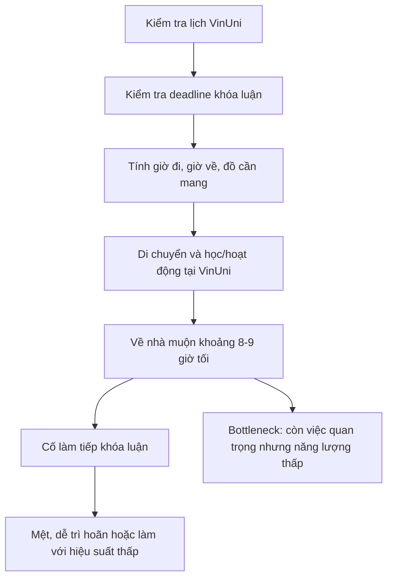
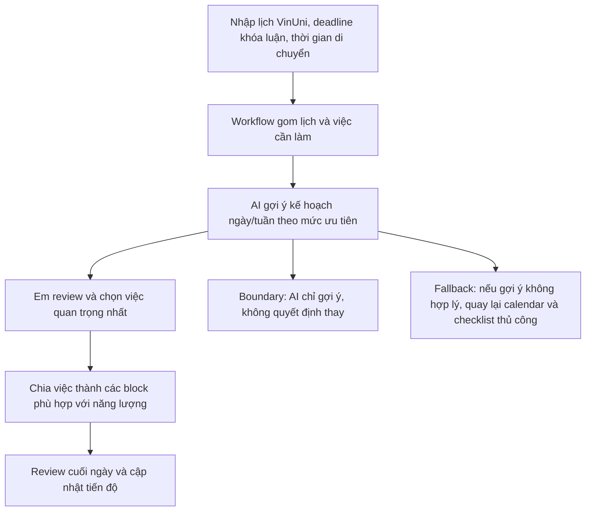
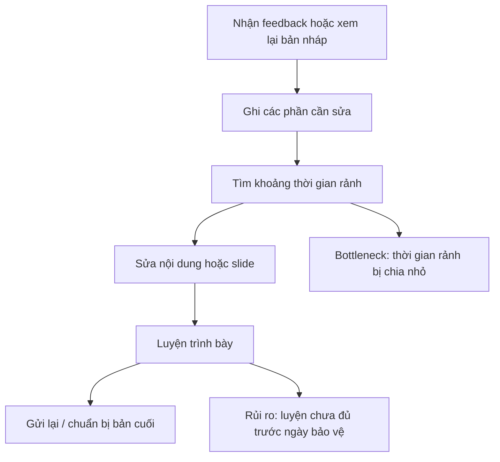
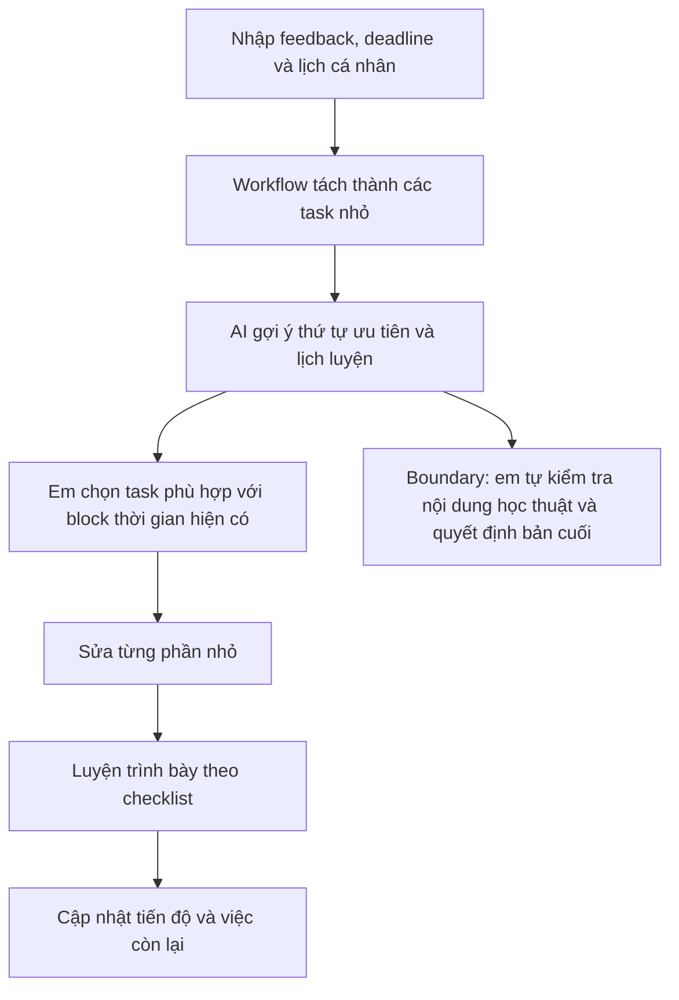
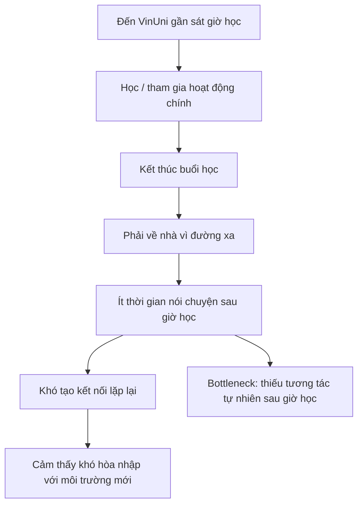
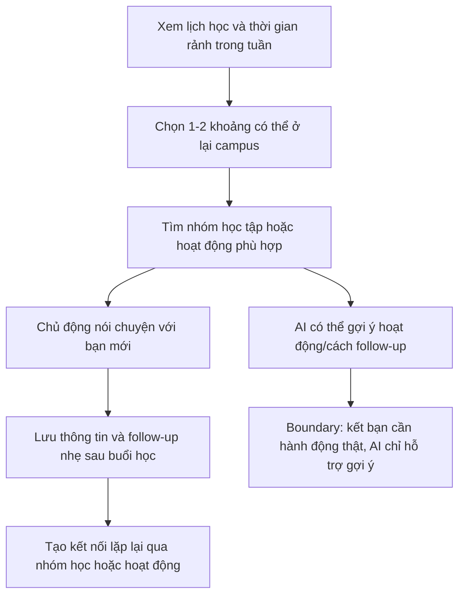

# 01 - Individual Problem Scan

## Bối cảnh cá nhân

Em là sinh viên năm cuối và đang trong giai đoạn chuẩn bị bảo vệ khóa luận. Cùng lúc đó, em thi đỗ một chương trình của Đại học VinUni. Đây là một cơ hội tốt, nhưng cũng làm lịch sinh hoạt của em thay đổi khá nhiều vì VinUni cách nơi em ở khoảng 20km.

Những ngày có lịch học hoặc hoạt động ở VinUni, em thường phải dậy sớm hơn bình thường và có hôm về đến nhà khoảng 8-9 giờ tối. Sau một ngày di chuyển và học tập, em vẫn còn việc của khóa luận cần xử lý, nhưng năng lượng và thời gian đều không còn nhiều. Ngoài chuyện học, em cũng thấy việc kết bạn trong môi trường mới không dễ, vì mình không có nhiều thời gian ở lại campus sau giờ học để nói chuyện hoặc tham gia hoạt động.

Từ bối cảnh này, em scan các vấn đề không chỉ từ trải nghiệm của bản thân mà còn từ những người xung quanh như sinh viên năm cuối, sinh viên mới tham gia môi trường mới, hoặc các bạn cũng phải di chuyển xa.

---

## 1. Scan rộng problems

| # | Lăng kính | Problem quan sát được | Ai đang đau? | Dấu hiệu thật |
|---|---|---|---|---|
| 1 | Tốn thời gian | Việc đi lại giữa nhà và VinUni lấy đi khá nhiều thời gian và năng lượng trong ngày | Em | Nhà cách trường khoảng 20km; có hôm phải dậy sớm và về nhà khoảng 8-9 giờ tối |
| 2 | Lặp lại | Mỗi ngày em phải tự tính lại lịch: hôm sau đi lúc mấy giờ, cần mang gì, còn việc gì của khóa luận | Em | Trước mỗi ngày học phải kiểm tra lịch, deadline, tài liệu, thời gian di chuyển |
| 3 | Tốn thời gian | Thời gian chuẩn bị bảo vệ khóa luận bị chia nhỏ, khó có một khoảng dài để làm sâu | Em | Khó có block 2-3 tiếng liên tục để sửa bài, làm slide hoặc luyện nói |
| 4 | AI có thể tốt hơn | Deadline, lịch học, lịch gặp giảng viên và các việc nhỏ đang nằm rải rác ở nhiều nơi | Em | Phải kiểm tra lịch, tin nhắn, email, note; dễ quên những task nhỏ nhưng quan trọng |
| 5 | Pain từ người khác | Nhiều sinh viên năm cuối cũng khó cân bằng giữa khóa luận, học thêm, thực tập hoặc chương trình mới | Sinh viên năm cuối | Nhiều bạn phải sửa bài sát deadline, thức khuya hoặc bị trùng nhiều việc quan trọng |
| 6 | Tốn thời gian | Sau khi về nhà muộn, em rất khó bắt đầu làm tiếp khóa luận dù biết việc đó quan trọng | Em | Về nhà mệt, dễ trì hoãn, nếu có làm thì hiệu suất thấp hơn |
| 7 | Pain từ người khác | Sinh viên mới hoặc sinh viên ngoại trú khó kết bạn nếu không có nhiều thời gian ở lại campus | Em và các bạn mới/ngoại trú | Ít cơ hội tham gia hoạt động sau giờ học, khó gặp lại cùng một nhóm bạn nhiều lần |
| 8 | Lặp lại | Các việc logistics nhỏ như kiểm tra phòng học, giờ học, đường đi, đồ cần mang cứ lặp lại và gây mệt | Em | Trước khi đi học thường phải kiểm tra nhiều thứ để tránh quên hoặc đến muộn |
| 9 | Tốn thời gian | Ăn uống và nghỉ ngơi bị động vì lịch di chuyển dài | Em | Có hôm ăn vội, nghỉ ít hoặc không có khoảng nghỉ rõ ràng giữa các hoạt động |
| 10 | AI có thể tốt hơn | Khi thời gian trong ngày quá ít, em khó biết nên ưu tiên việc nào trước | Em | Khóa luận, lịch VinUni, sức khỏe và việc làm quen môi trường mới đều quan trọng |

---

## 2. Chọn top 3 problems

| Rank | Problem | Vì sao chọn | Điều còn chưa chắc |
|---|---|---|---|
| 1 | Khó quản lý thời gian giữa khóa luận, VinUni và việc di chuyển xa | Đây là vấn đề xảy ra thường xuyên nhất, ảnh hưởng trực tiếp đến học tập, sức khỏe và tiến độ khóa luận. Workflow cũng khá rõ để phân tích | Em cần đo kỹ hơn mỗi ngày thực sự mất bao nhiêu thời gian cho di chuyển, chuẩn bị và phục hồi năng lượng |
| 2 | Việc chuẩn bị bảo vệ khóa luận bị gián đoạn vì không có đủ thời gian học sâu | Đây là vấn đề quan trọng vì bảo vệ khóa luận có deadline thật và hậu quả khá rõ nếu chuẩn bị không đủ | Chưa chắc bottleneck chính là thiếu thời gian, thiếu năng lượng hay thiếu cách chia nhỏ việc |
| 3 | Khó kết bạn và xây dựng quan hệ ở môi trường mới vì lịch đi về hạn hẹp | Vấn đề này không chỉ ảnh hưởng đến cảm xúc mà còn ảnh hưởng đến việc học nhóm, hỏi bài và hòa nhập | Metric khó đo hơn, cần hỏi thêm các bạn cũng học xa nhà hoặc mới vào môi trường VinUni |

---

## 3. Problem Card #1 - Quản lý thời gian giữa khóa luận, VinUni và di chuyển xa

**Problem 1 câu:**  
Em đang phải chia thời gian giữa khóa luận, chương trình ở VinUni và việc di chuyển xa, nên mỗi ngày dễ rơi vào trạng thái bận liên tục nhưng vẫn không chắc việc quan trọng nhất đã được làm.

**Actor:**  
Sinh viên năm cuối vừa chuẩn bị bảo vệ khóa luận vừa tham gia một chương trình mới tại VinUni.

**Thời điểm / bối cảnh:**  
Những ngày có lịch học hoặc hoạt động ở VinUni. Em phải di chuyển khoảng 20km từ nhà đến trường và có hôm về nhà khoảng 8-9 giờ tối.

**Current workflow 3-7 bước:**

1. Kiểm tra lịch học hoặc hoạt động ở VinUni.
2. Kiểm tra deadline và những việc cần làm cho khóa luận.
3. Tính giờ đi, giờ về và chuẩn bị đồ cần mang.
4. Di chuyển đến VinUni và tham gia lịch học/hoạt động.
5. Về nhà muộn.
6. Cố gắng làm tiếp khóa luận hoặc chuẩn bị cho ngày hôm sau.

**Bottleneck:**  
Bottleneck lớn nhất nằm ở đoạn sau khi về nhà. Lúc đó em vẫn còn việc quan trọng, nhưng năng lượng thấp nên rất khó bắt đầu làm sâu. Nếu cố làm thì thường chậm, dễ mất tập trung hoặc chỉ xử lý được các việc nhỏ.

**Impact:**  
Khóa luận dễ bị dồn vào buổi tối muộn hoặc cuối tuần. Em cũng dễ rơi vào cảm giác ngày nào cũng bận nhưng tiến độ không rõ ràng. Về lâu dài, việc này có thể ảnh hưởng đến chất lượng chuẩn bị bảo vệ và cả sức khỏe.

**Success metric:**  
Giảm thời gian tự lập kế hoạch mỗi ngày từ khoảng 20-30 phút xuống dưới 10 phút. Mỗi tuần tạo được ít nhất 1-2 block tập trung rõ ràng cho khóa luận, thay vì chỉ làm khi còn dư thời gian.

**Non-AI alternative:**  
Dùng Google Calendar, checklist cố định, template lịch tuần và đặt trước các block làm khóa luận. Nếu kỷ luật tốt, cách này có thể giải quyết một phần lớn vấn đề.

**AI hypothesis:**  
AI có thể hỗ trợ tổng hợp lịch học, deadline, thời gian di chuyển và mức độ ưu tiên để gợi ý lịch ngày/tuần hợp lý hơn. Tuy nhiên AI chỉ nên đóng vai trò gợi ý. Người quyết định cuối cùng vẫn phải là em, vì chỉ em biết hôm đó mình còn bao nhiêu sức và việc nào thật sự gấp.

**Quick gut:**  
Workflow.

### Draft current workflow

### Draft future workflow

---

## 4. Problem Card #2 - Chuẩn bị bảo vệ khóa luận bị chia nhỏ và gián đoạn

**Problem 1 câu:**  
Việc chuẩn bị bảo vệ khóa luận bị ảnh hưởng vì thời gian rảnh của em bị chia nhỏ bởi lịch học ở VinUni và việc di chuyển xa.

**Actor:**  
Sinh viên năm cuối đang chuẩn bị bảo vệ khóa luận.

**Thời điểm / bối cảnh:**  
Giai đoạn trước bảo vệ, khi em cần sửa nội dung, hoàn thiện slide, luyện trình bày và phản hồi feedback của giảng viên.

**Current workflow 3-7 bước:**

1. Nhận feedback từ giảng viên hoặc tự xem lại bản nháp.
2. Ghi lại những phần cần sửa.
3. Tìm khoảng thời gian rảnh trong lịch học và di chuyển.
4. Sửa nội dung khóa luận hoặc slide.
5. Luyện trình bày.
6. Gửi lại bản mới hoặc chuẩn bị bản cuối.

**Bottleneck:**  
Em khó có một khoảng thời gian đủ dài và đủ tỉnh táo để sửa bài hoặc luyện nói nghiêm túc. Nhiều khi có thời gian nhưng lại là cuối ngày, lúc đầu óc không còn sắc như buổi sáng.

**Impact:**  
Việc sửa khóa luận có nguy cơ bị dồn sát deadline. Phần luyện trình bày cũng dễ bị xem nhẹ dù đây là phần rất quan trọng khi bảo vệ. Nếu không xử lý tốt, em có thể bước vào buổi bảo vệ trong trạng thái chưa đủ tự tin.

**Success metric:**  
Mỗi tuần có ít nhất 3 phiên tập trung 60-90 phút cho khóa luận. Trước ngày bảo vệ, số việc còn lại trong checklist giảm dần thay vì dồn vào những ngày cuối.

**Non-AI alternative:**  
Chia khóa luận thành các task nhỏ, đặt lịch cố định cho từng phần, hoặc ở lại campus làm bài trước khi về nhà để tận dụng lúc còn tỉnh táo.

**AI hypothesis:**  
AI có thể giúp tách feedback thành các task nhỏ, gợi ý thứ tự ưu tiên, tạo lịch luyện bảo vệ theo thời gian còn lại và đặt câu hỏi giả định để em tự luyện. Phần nội dung học thuật vẫn phải do em kiểm tra và quyết định.

**Quick gut:**  
Workflow.

### Draft current workflow

### Draft future workflow

---

## 5. Problem Card #3 - Khó kết bạn và xây dựng quan hệ ở môi trường mới

**Problem 1 câu:**  
Khi tham gia môi trường mới tại VinUni, em khó kết bạn hơn vì phải đi về xa, ít ở lại campus và ít có những tương tác tự nhiên sau giờ học.

**Actor:**  
Sinh viên mới hoặc sinh viên ngoại trú tham gia chương trình tại VinUni.

**Thời điểm / bối cảnh:**  
Những tuần đầu tham gia chương trình, khi em cần làm quen bạn mới, tìm nhóm học tập và hiểu dần văn hóa của môi trường mới.

**Current workflow 3-7 bước:**

1. Đến trường gần sát giờ học.
2. Học hoặc tham gia hoạt động chính.
3. Kết thúc buổi học.
4. Phải về nhà vì đường xa và hôm sau còn việc khác.
5. Ít có thời gian nói chuyện thêm với bạn mới.
6. Lần sau gặp lại thì cảm giác vẫn chưa thân, gần như phải bắt đầu lại.

**Bottleneck:**  
Vấn đề không hẳn là em không muốn kết bạn, mà là thiếu thời gian và thiếu tình huống lặp lại để gặp cùng một nhóm người nhiều lần. Kết bạn thường cần sự đều đặn, trong khi lịch của em lại khá gấp.

**Impact:**  
Em có thể cảm thấy khó hòa nhập hơn, ít có người để hỏi bài hoặc trao đổi thông tin. Điều này cũng làm trải nghiệm ở môi trường mới kém tự nhiên hơn so với những bạn có nhiều thời gian ở lại campus.

**Success metric:**  
Trong 2-3 tuần, có ít nhất 3-5 kết nối mới đủ thân để có thể nhắn hỏi bài hoặc rủ học nhóm. Tham gia được ít nhất 1 nhóm học tập hoặc hoạt động nhỏ ở VinUni.

**Non-AI alternative:**  
Chủ động ở lại campus một buổi mỗi tuần, tham gia một CLB/nhóm học tập, hoặc đặt mục tiêu nói chuyện với 1-2 bạn mới sau mỗi buổi học.

**AI hypothesis:**  
AI có thể hỗ trợ nhẹ bằng cách gợi ý lịch networking, nhắc follow-up hoặc gợi ý cách bắt đầu cuộc trò chuyện. Tuy nhiên đây không phải vấn đề cần AI mạnh. Phần chính vẫn là thay đổi lịch cá nhân và chủ động giao tiếp thật.

**Quick gut:**  
No AI / Workflow nhẹ.

### Draft current workflow

### Draft future workflow

