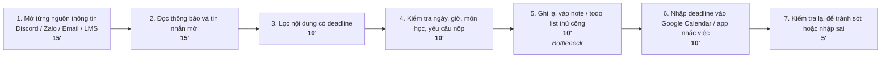
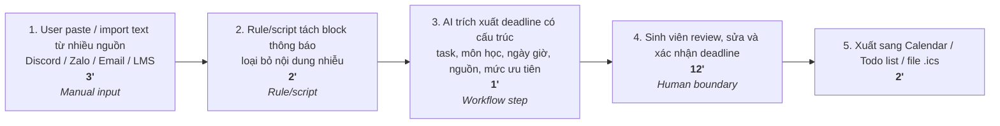

# 02 — Group Problem Statement

## Chủ đề nhóm chọn

**Theo dõi & cập nhật deadline từ nhiều nguồn**

Sinh viên thường phải theo dõi deadline, lịch nộp bài và thông báo học tập từ nhiều nguồn rời rạc như Discord, Zalo, email, LMS, Google Classroom, cổng thông tin trường và note cá nhân. Quy trình hiện tại chủ yếu làm thủ công: mở từng nền tảng, đọc thông báo, lọc deadline, kiểm tra ngày giờ, rồi tự nhập vào note, todo list hoặc calendar.

Điểm đau chính không nằm ở việc dùng calendar, mà nằm ở bước **gom, hiểu và chuẩn hóa thông tin deadline rải rác** trước khi đưa vào calendar/task list.

---

# 1. Group convergence

Nhóm 3–4 người, mỗi người share top 3. Tổng cộng khoảng 9–12 candidates.

| Cluster | Candidate examples | Pattern chung |
|---|---|---|
| **Tìm kiếm / truy xuất / hỏi đáp thông tin học tập** | Học liệu AI cá nhân hóa, Trợ lý học tập 24/7, kho note công nghệ khó truy vấn, tìm lại câu trả lời cũ trong Discord | Thông tin đã tồn tại nhưng rải rác, khó tìm lại đúng lúc. Người học phải tự search, đọc, lọc hoặc hỏi lại. |
| **Quản lý deadline, lịch cá nhân và logistics** | Theo dõi deadline từ Discord/Outlook/Zalo/LMS, quản lý thời gian giữa khóa luận và VinUni, đi học/đi bus mất thời gian | Sinh viên phải tự gom lịch, deadline, thời gian di chuyển và việc cần làm từ nhiều nguồn. |
| **Chuẩn bị học tập / làm bài bị gián đoạn** | Chuẩn bị bảo vệ khóa luận bị chia nhỏ, setup môi trường lab mất thời gian, bị nghẽn bài tập ban đêm phải chờ TA | Người học muốn làm việc chính nhưng bị kẹt ở bước phụ: setup, debug, chờ hỗ trợ hoặc thiếu block thời gian đủ sâu. |
| **Feedback / phối hợp nhóm / rework** | Feedback không nhất quán, thành viên trì hoãn công việc | Công việc nhóm bị chậm vì phản hồi không rõ, thay đổi nhiều lần hoặc thành viên không hoàn thành đúng hạn. |
| **Cá nhân hóa kế hoạch sinh hoạt / phát triển bản thân** | Lịch trình Gym cá nhân hóa, học liệu đúng trình độ, lộ trình học AI đúng cấp độ | Người dùng không biết chọn kế hoạch phù hợp với năng lực, thể trạng hoặc mục tiêu hiện tại. |
| **Số hóa / chuẩn hóa dữ liệu thô** | Số hóa ghi chú viết tay, note công nghệ rời rạc, feedback nhiều phiên bản | Dữ liệu ban đầu ở dạng thô, lộn xộn hoặc khó đọc, cần chuyển thành cấu trúc rõ ràng để tìm kiếm hoặc hành động tiếp. |
| **Hòa nhập xã hội / kết nối trong môi trường mới** | Khó kết bạn ở VinUni vì đi về xa, ít thời gian ở lại campus | Pain không nằm ở học thuật mà ở trải nghiệm xã hội. Thiếu thời gian gặp lặp lại khiến khó tạo quan hệ và khó hòa nhập. |

---

# 2. Shortlist và score

Thang điểm: **7 tiêu chí × 5 điểm = 35 điểm**.

| Rank | Candidate problem | Actor rõ | Workflow rõ | Pain có evidence | Impact đo được | Làm trong lab | So sánh R/W/A được | Nhóm hiểu domain | Tổng |
|---:|---|---:|---:|---:|---:|---:|---:|---:|---:|
| **1** | **Theo dõi & cập nhật deadline từ nhiều nguồn** | 5 | 5 | 5 | 5 | 5 | 5 | 5 | **35** |
| **2** | **Tìm lại quyết định/câu trả lời cũ trong Discord lớp** | 5 | 5 | 5 | 5 | 4 | 5 | 5 | **34** |
| **3** | **Kho note công nghệ cá nhân khó truy vấn** | 5 | 5 | 5 | 5 | 5 | 4 | 5 | **34** |
| **4** | **Trợ lý học tập 24/7 cho bài tập/lập trình** | 5 | 5 | 5 | 5 | 4 | 5 | 5 | **34** |
| **5** | **Setup môi trường lab mất thời gian** | 5 | 5 | 4 | 5 | 5 | 4 | 5 | **33** |
| **6** | **AI learning material finder / học liệu AI cá nhân hóa** | 5 | 5 | 4 | 4 | 5 | 5 | 5 | **33** |
| **7** | **Quản lý thời gian giữa khóa luận, VinUni và di chuyển xa** | 5 | 5 | 5 | 4 | 4 | 5 | 5 | **33** |
| **8** | **Chuẩn bị bảo vệ khóa luận bị chia nhỏ/gián đoạn** | 5 | 5 | 4 | 5 | 4 | 5 | 5 | **33** |
| **9** | **Feedback không nhất quán gây rework nhiều lần** | 5 | 5 | 4 | 4 | 4 | 5 | 4 | **31** |
| **10** | **Số hóa ghi chú viết tay cuối tuần** | 5 | 4 | 4 | 4 | 5 | 4 | 4 | **30** |
| **11** | **Thành viên trì hoãn công việc nhóm** | 5 | 4 | 4 | 4 | 3 | 4 | 4 | **28** |
| **12** | **Đi học/di chuyển xa mất nhiều thời gian** | 5 | 4 | 5 | 4 | 2 | 3 | 4 | **27** |
| **13** | **Lịch trình Gym cá nhân hóa** | 5 | 5 | 3 | 4 | 4 | 4 | 2 | **27** |
| **14** | **Di chuyển bằng xe bus tại Hà Nội** | 5 | 4 | 4 | 4 | 2 | 3 | 3 | **25** |
| **15** | **Khó kết bạn/xây dựng quan hệ ở môi trường mới** | 4 | 3 | 4 | 3 | 3 | 3 | 4 | **24** |

## Nhóm chọn

**Theo dõi & cập nhật deadline từ nhiều nguồn.**

## Vì sao chọn

- Có workflow rõ nhất: mở nguồn → đọc thông báo → lọc deadline → kiểm tra ngày giờ → ghi lại → nhập calendar → kiểm tra lại.
- Pain lặp lại hằng tuần và gần với sinh viên.
- Dễ validate nhanh bằng phỏng vấn sinh viên.
- Dễ làm prototype trong lab bằng dữ liệu paste thủ công, chưa cần kết nối API thật.
- Dễ đo before/after bằng thời gian, số bước, số deadline bị sót và số lỗi cần sửa.
- Có thể so sánh rõ Rule / Workflow / Agent.
- Nhóm hiểu domain vì đều từng phải theo dõi deadline từ nhiều kênh học tập.

## Vì sao không chọn các bài khác

- **Discord Search:** impact tốt nhưng data access phức tạp, dễ trượt sang hệ thống search/agent lớn.
- **Tech Note Search:** dễ làm nhưng pain hẹp hơn, chủ yếu cho người học kỹ thuật/dev.
- **AI Tutor 24/7:** hấp dẫn nhưng scope lớn, cần RAG và đánh giá độ đúng/sai.
- **Feedback inconsistency:** workflow rõ nhưng khó thống nhất quality metric trong thời gian lab.
- **Gym/Bus/Kết bạn:** có pain thật nhưng không mạnh bằng deadline trong bối cảnh học tập/lab.

---

# 3. Quick validation

Nhóm hỏi nhanh sinh viên trong lớp hoặc bạn bè có nhiều môn học/nhóm chat.

| Nguồn | Số người | Tín hiệu xác nhận | Tín hiệu phản bác | Nhóm sửa problem thế nào |
|---|---:|---|---|---|
| Quick interview | 3 | 2/3 người phải check deadline từ nhiều nguồn như Zalo, email, LMS, Discord; đều từng mất thời gian lọc thông báo | 1 người nói chỉ cần dùng Google Calendar thủ công là đủ | Thu hẹp problem: không phải “calendar app”, mà là “extract deadline từ thông báo rời rạc” |
| Mini poll trong lớp | 6 | 4/6 từng bị sót deadline hoặc phải hỏi lại bạn vì không thấy thông báo | Một số deadline đã được giáo viên ghi rõ trên LMS nên không cần AI | Thêm non-AI alternative: checklist/template + calendar export |

## Insight sau validation

Pain thật không nằm ở việc lưu deadline. Google Calendar, Todoist hoặc Notion đã làm tốt phần lưu trữ và nhắc việc. Pain nằm ở đoạn **biến nhiều thông báo rời rạc thành danh sách deadline rõ ràng, có thể kiểm tra và hành động được**.

---

# 4. Research giải pháp

Nhóm tìm các hướng đã có sẵn, không giả định phải tự build từ đầu.

| Nguồn / tool / case | Link | Họ giải quyết phần nào? | Điểm mạnh | Khoảng trống / rủi ro | Bài học cho nhóm |
|---|---|---|---|---|---|
| **Google Calendar – Events from Gmail** | https://support.google.com/calendar/answer/6084018 | Tự hiển thị một số event từ Gmail vào Google Calendar | Có sẵn trong hệ sinh thái Google, phù hợp email có format rõ | Không gom từ Zalo, Discord, LMS; không chắc bắt được deadline bài tập dạng text tự do | Calendar là output tốt, nhưng input cần rộng hơn Gmail |
| **Gemini in Gmail – Add to Calendar** | https://workspaceupdates.googleblog.com/2025/03/add-events-to-google-calendar-using-gemini-in-gmail.html | Gemini phát hiện nội dung liên quan lịch trong email và gợi ý thêm vào Calendar | Có AI đọc ngữ cảnh email, giảm nhập tay, có bước xác nhận | Chủ yếu xử lý email; cần gói Workspace/Gemini; chưa xử lý chat như Discord/Zalo | Pattern tốt: AI extract → user confirm → add calendar |
| **Microsoft To Do + Outlook Flagged Email** | https://support.microsoft.com/en-us/office/using-microsoft-to-do-with-flagged-email-from-outlook-f90c37b0-4453-4756-a6d5-e2ef8d33b395 | Biến email được flag trong Outlook thành task, có thể thêm due date/reminder | Rõ workflow task management, phù hợp người dùng Outlook | Phụ thuộc thao tác flag thủ công; chỉ hỗ trợ email chính, không hỗ trợ nhiều nguồn | Manual capture vẫn hữu ích, nhưng cần giảm thao tác copy/flag nhiều lần |
| **Todoist + Calendar integrations** | https://www.todoist.com/integrations | Quản lý task, deadline, tích hợp Google Calendar/Outlook | Todo app mạnh, có due date, priority, calendar view và nhiều integration | Người dùng vẫn phải tự nhập task hoặc kết nối từng nguồn; không chuyên cho deadline học tập từ chat/LMS | Nên học cách Todoist biểu diễn task: title, due date, priority, source |
| **Zapier – AI extract emails to tasks/calendar** | https://zapier.com/automation/use-case/using-ai-identify-actionable-items-from-emails-and-create-tasks-in-a-project-management-system | Dùng AI quét email, trích xuất action item/deadline rồi tạo task | No-code, workflow rõ, kết nối được nhiều app | Có thể tốn phí; setup phức tạp với sinh viên; dễ sai nếu AI tự tạo task không có review | MVP có thể mô phỏng workflow Zapier nhưng đơn giản hơn: paste text → extract → review |
| **Zapier – Email to Google Calendar** | https://zapier.com/apps/email/integrations/google-calendar | Tạo event Google Calendar từ email hoặc parser | Dễ tự động hóa pipeline email → calendar | Vẫn cần cấu hình trigger/parser; không gom được nguồn phi-email nếu chưa tích hợp | Automation nên có human-in-the-loop trước khi ghi vào lịch |
| **Motion AI Calendar** | https://www.usemotion.com/ | AI tự ưu tiên task và time-block lên calendar | Mạnh ở bước lập lịch sau khi đã có task/deadline | Không tập trung vào việc lấy deadline từ nhiều nguồn rời rạc | Nhóm không nên làm full AI scheduler trước; trước hết cần extract deadline đúng |
| **Reclaim AI** | https://reclaim.ai/ | Tự schedule task, habit, meeting, break vào Google/Outlook Calendar | Tốt cho time blocking và bảo vệ thời gian làm việc | Cần task đã được nhập hoặc sync từ app khác; không giải quyết sâu bài toán đọc Zalo/Discord/LMS | Sau khi extract deadline, có thể thêm bước gợi ý slot làm bài |
| **Reclaim Tasks** | https://help.reclaim.ai/en/articles/5108936-tasks-overview-protect-time-for-task-work-before-deadlines | Task có duration, due date; hệ thống tự tìm thời gian trước deadline | Có model dữ liệu tốt: task name, duration, due date, priority | Không phải tool gom deadline từ nguồn thô; cần người dùng nhập task tương đối rõ | MVP nên cho user nhập thêm duration/priority sau khi AI extract |
| **Notion AI Connector for Google Calendar** | https://www.notion.com/help/google-calendar-ai-connector | Kết nối Google Calendar vào Notion AI để hỏi/làm việc với dữ liệu lịch | Tốt nếu người dùng đã dùng Notion, có thể hỏi thông tin lịch bằng AI | Cần Business/Enterprise và quyền admin Google Workspace; không xử lý nguồn Zalo/Discord/LMS | Notion phù hợp làm dashboard, nhưng không nên phụ thuộc vào nó cho MVP |
| **Akiflow** | https://todoist.com/integrations/apps/akiflow | Gom task từ Gmail, Slack, Todoist rồi time-block vào calendar | Đúng hướng “unified inbox”, gom task nhiều nguồn | Có thể quá phức tạp/overkill; vẫn thiên về productivity cá nhân, không tối ưu riêng cho deadline sinh viên | Ý tưởng “Unified Inbox” đáng học: mọi deadline về một hàng đợi chờ duyệt |
| **Google Calendar API** | https://developers.google.com/workspace/calendar/api/guides/create-events | Cho phép tạo event bằng API với start/end time | Dễ dùng làm output kỹ thuật nếu nhóm build prototype | API chỉ là phần ghi lịch; không giải quyết việc hiểu nội dung deadline | Kỹ thuật build: extract JSON deadline → preview → gọi Calendar API |

## Research takeaway

Các giải pháp hiện có chia thành 3 nhóm chính:

| Nhóm giải pháp | Ví dụ | Nhận xét |
|---|---|---|
| **Calendar/task app** | Google Calendar, Microsoft To Do, Todoist | Mạnh ở lưu deadline, nhắc việc, hiển thị lịch; yếu ở bước lấy thông tin từ nguồn rời rạc. |
| **AI extract từ một nguồn** | Gemini in Gmail, Zapier AI email parser | Mạnh khi input là email; chưa giải quyết tốt Discord/Zalo/LMS/note cá nhân cùng lúc. |
| **AI scheduling/time-blocking** | Motion, Reclaim, Akiflow | Mạnh sau khi task đã sạch; chưa phải giải pháp chính cho việc phát hiện deadline từ text thô. |

**Kết luận:** Không nên build một calendar app hay agent tự động toàn bộ ngay từ đầu. Hướng hợp lý hơn là **Workflow**: user gom/paste input, rule/script lọc thô, AI trích xuất deadline, user review, rồi mới export sang calendar/task list.

---

# 5. Workflow before/after

File nhóm nộp kèm:

`02-Group Problem Statement.md`

## CURRENT STATE — 7 bước, khoảng 75 phút/tuần

## FUTURE STATE — 5 bước, khoảng 20 phút/tuần

## Fallback

AI trích xuất sai, thiếu thông tin hoặc hiểu nhầm deadline → sinh viên bỏ draft, sửa thủ công hoặc tự nhập lại deadline như cách cũ.

## Bottleneck mới

Bottleneck mới là **sinh viên review, sửa và xác nhận deadline**. Đây là bottleneck chấp nhận được vì deadline là thông tin quan trọng. Nếu AI tự động thêm deadline sai vào lịch mà không có kiểm tra, người dùng có thể bị nhắc sai ngày, bỏ sót bài hoặc chuẩn bị nhầm yêu cầu.

## Before/after impact

| Metric | Trước | Sau kỳ vọng | Ghi chú |
|---|---:|---:|---|
| Tổng thời gian / tuần | 75 phút | Dưới 25 phút | Target chính |
| Số bước | 7 | 5 | Giảm bước đọc, lọc và nhập thủ công |
| Bước thủ công | 7/7 | 2/5 | User vẫn paste/import và review |
| Số nguồn phải tự mở | 5–7 nguồn | 1 nơi tổng hợp | Giảm context switching |
| Bottleneck chính | Ghi lại và nhập deadline thủ công | Review/edit deadline | Human boundary |
| Khả năng sót deadline | Cao | Thấp hơn | Vì deadline được gom thành inbox |
| Risk mới | Không có AI hallucination | Có hallucination/extraction risk | Cần review trước khi lưu |
| Output | Note rời rạc / calendar thủ công | Deadline có cấu trúc | Có thể xuất calendar/todo |

---

# 6. Problem Statement v0

| Field | Nội dung |
|---|---|
| **Actor** | Sinh viên phải theo dõi deadline, lịch nộp bài và thông báo học tập từ nhiều nguồn khác nhau. |
| **Workflow** | Mỗi tuần sinh viên mở Discord, Zalo, email, LMS, Google Classroom hoặc cổng thông tin trường; đọc thông báo mới; lọc nội dung có deadline; kiểm tra ngày giờ; ghi lại vào note/todo list; nhập vào calendar; kiểm tra lại để tránh sót. |
| **Bottleneck** | Bước lọc và ghi lại deadline thủ công mất nhiều thời gian nhất, vì sinh viên phải tự đọc nhiều nguồn rời rạc, hiểu ngữ cảnh, xác định task chính, chuẩn hóa ngày giờ và nhập lại sang công cụ khác. |
| **Impact** | Tổng workflow có thể mất khoảng 60–80 phút/tuần; dễ sót deadline, nhập sai ngày giờ hoặc quên yêu cầu phụ; sinh viên bị động trong việc lập kế hoạch học tập. |
| **Success Metric** | Giảm tổng thời gian theo dõi và cập nhật deadline xuống dưới 20–25 phút/tuần; giảm số deadline bị bỏ sót; không tăng số deadline sai hoặc nhắc nhầm. |
| **Boundary** | Không tự động thêm deadline vào calendar nếu người dùng chưa xác nhận; không tự bịa ngày giờ nếu thông tin không rõ; không thay sinh viên quyết định deadline nào quan trọng; chỉ dùng thông tin được người dùng paste/import. |

---

# 7. Rule / Workflow / Agent

| Mức | Phương án | Khi nào đủ | Rủi ro | Chọn? |
|---|---|---|---|---|
| **Rule** | Regex nhận diện ngày giờ, template todo list, script xuất `.ics`, rule lọc keyword như “deadline”, “nộp”, “due”, “submit” | Đủ nếu thông báo có format rõ, ngày giờ viết chuẩn và ít nguồn | Không hiểu được ngữ cảnh tự nhiên như “tối thứ sáu tuần này”, “trước buổi lab sau”, “nộp trước khi thầy điểm danh”; dễ bỏ sót deadline viết không theo mẫu | Không chọn làm toàn bộ, nhưng dùng cho bước lọc thô, chuẩn hóa format và export |
| **Workflow** | User paste/import text → rule/script tách block → AI trích xuất deadline có cấu trúc → user review → xuất calendar/todo list | Hợp vì quy trình tuyến tính, AI chỉ hỗ trợ bước đọc hiểu và cấu trúc hóa thông tin | AI có thể hiểu sai ngày, bỏ sót yêu cầu phụ hoặc tạo deadline từ thông tin không chắc chắn; cần user review | **Chọn** |
| **Agent** | Agent tự đọc nhiều nguồn như Discord/Zalo/email/LMS, tự tìm deadline, tự hỏi lại khi thiếu thông tin, tự thêm vào calendar | Chỉ cần nếu hệ thống phải tự hoạt động đa nguồn, nhiều quyền truy cập, nhiều nhánh xử lý động | Quá rộng cho scope lab; rủi ro permission, privacy, hallucination, tự thêm sai deadline; khó demo nếu không có API thật | Chưa chọn |

## Mức chọn

**Workflow.**

## Vì sao

- Data input có thể bắt đầu bán thủ công bằng cách cho user paste thông báo từ Discord, Zalo, email hoặc LMS.
- Rule/script đủ dùng cho bước tách block, lọc keyword, chuẩn hóa định dạng ngày giờ đơn giản và xuất file `.ics`.
- AI phù hợp với bước cần hiểu ngôn ngữ tự nhiên: nhận diện deadline, task chính, môn học, yêu cầu nộp và thông tin còn thiếu.
- Sinh viên vẫn review trước khi lưu nên kiểm soát được rủi ro.
- Chưa cần agent vì MVP không cần tự đăng nhập, tự đọc nhiều nền tảng hoặc tự quyết định deadline nào được thêm vào lịch.

---

# 8. Problem Statement v1

| Field | Nội dung |
|---|---|
| **Actor** | Sinh viên có nhiều môn học, nhiều nhóm chat và nhiều kênh thông báo học tập. |
| **Workflow** | Mở từng nguồn như Discord/Zalo/email/LMS → đọc thông báo → lọc deadline → kiểm tra ngày giờ/yêu cầu nộp → ghi vào note/todo list → nhập calendar → kiểm tra lại. |
| **Bottleneck** | Lọc deadline và nhập lại thủ công từ nhiều nguồn mất khoảng 60–80 phút/tuần, dễ sót thông tin hoặc nhập sai ngày giờ. |
| **Impact** | Sinh viên dễ bỏ lỡ deadline, quên yêu cầu phụ, bị động trong kế hoạch học tập và mất thời gian lặp lại mỗi tuần cho việc kiểm tra thông báo. |
| **Success Metric** | Giảm tổng thời gian theo dõi/cập nhật deadline xuống dưới 20–25 phút/tuần; giảm deadline bị sót; user không phải sửa quá nhiều deadline AI trích xuất. |
| **Boundary** | AI không tự thêm deadline vào calendar khi chưa có xác nhận; không bịa ngày giờ nếu thông tin mơ hồ; không thay user quyết định mức ưu tiên cuối cùng; chỉ xử lý dữ liệu người dùng cung cấp. |
| **AI intervention point** | Sau khi user gom/paste nội dung từ nhiều nguồn, trước bước user tự ghi deadline vào note hoặc calendar. |
| **Mức chọn** | Workflow: rule/script tách block và chuẩn hóa format, AI trích xuất deadline, user review, sau đó mới export sang calendar/todo list. |
| **Rủi ro & người thật kiểm tra** | Risk: hallucination ngày giờ, hiểu sai “tuần này/tuần sau”, bỏ sót yêu cầu phụ, trích nhầm thông báo không phải deadline. Người thật review: sinh viên phải kiểm tra task, ngày giờ, môn học, nguồn và reminder trước khi lưu. |

---

# 9. Final decision

## Decision

**Go với scope nhỏ.**

Nhóm sẽ không build một calendar app hoàn chỉnh và cũng không làm agent tự đọc tất cả nền tảng ngay từ đầu. Nhóm chỉ tập trung vào khoảng trống chính:

> Biến thông báo deadline rời rạc từ nhiều nguồn thành danh sách deadline có cấu trúc, có kiểm duyệt và có thể xuất sang calendar/todo list.

## Pilot nhỏ nhất

Dùng dữ liệu mẫu từ 1–2 tuần gần nhất của các thành viên trong nhóm.

Nguồn dữ liệu có thể gồm:

- Tin nhắn Discord lớp
- Tin nhắn Zalo nhóm
- Email từ giảng viên
- Thông báo LMS hoặc Google Classroom
- Note cá nhân về bài tập/deadline

Quy trình pilot:

1. Mỗi thành viên chọn 5–10 thông báo có khả năng chứa deadline.
2. Paste nội dung vào prompt hoặc prototype.
3. AI trích xuất deadline theo cấu trúc chuẩn.
4. Sinh viên review và sửa lại nếu cần.
5. Xuất kết quả thành bảng deadline hoặc file `.ics`.
6. Đo thời gian từ lúc bắt đầu đọc thông báo đến lúc có danh sách deadline đã xác nhận.

## Output pilot

| Field | Mô tả |
|---|---|
| **Task** | Việc cần làm |
| **Course/Project** | Môn học hoặc project liên quan |
| **Due date** | Ngày/giờ deadline |
| **Source** | Nguồn lấy thông tin: Discord/Zalo/email/LMS |
| **Extra requirement** | Yêu cầu phụ, ví dụ file PDF, slide, demo, form |
| **Confidence** | High/Medium/Low |
| **Status** | Need review / Confirmed / Need clarification |

## Exit / rollback

- Nếu trong 2 tuần liên tiếp, user phải sửa lại hơn **50% deadline AI trích xuất**, nhóm sẽ hạ scope xuống: **rule-based deadline checklist + template nhập calendar thủ công**.
- Nếu AI thường xuyên bịa ngày giờ hoặc hiểu sai các cụm như “thứ sáu tuần này”, “buổi lab sau”, “trước tiết học tới”, nhóm sẽ không cho AI tự điền ngày cụ thể. Output sẽ là **Need clarification**.
- Nếu việc tích hợp Google Calendar hoặc API phức tạp, MVP chỉ xuất Markdown table, CSV, `.ics` file hoặc todo list format.
- Nếu người dùng không tin tưởng AI để thêm deadline vào lịch, nhóm giữ human review là bắt buộc và chỉ dùng AI như công cụ draft.

## Decision rationale

- Problem rõ và gần với đời sống sinh viên.
- Workflow hiện tại có nhiều bước thủ công, dễ mô tả before/after.
- Bottleneck rõ: đọc, lọc, chuẩn hóa và nhập deadline từ nhiều nguồn.
- Metric rõ: thời gian theo dõi deadline mỗi tuần, số deadline bị sót, số lỗi cần sửa.
- Có non-AI components: rule/script, table, export `.ics`, todo list.
- AI nằm ở một bước cụ thể: trích xuất deadline có cấu trúc từ text thô.
- Human review rõ: sinh viên phải kiểm tra trước khi lưu.
- Scope MVP đủ nhỏ để làm trong lab: paste text → extract → review → export.
- Có hướng mở rộng sau này: tích hợp Google Calendar, email parser, Discord bot, LMS connector hoặc reminder system.

---

# 10. Final Problem Statement

Sinh viên thường phải theo dõi deadline từ nhiều nguồn rời rạc như Discord, Zalo, email, LMS và cổng thông tin trường. Quy trình hiện tại yêu cầu sinh viên tự mở từng nguồn, đọc thông báo, lọc deadline, kiểm tra ngày giờ và nhập lại vào note hoặc calendar. Việc này mất khoảng 60–80 phút mỗi tuần, dễ gây sót deadline hoặc nhập sai thông tin.

Nhóm đề xuất một workflow hỗ trợ bằng AI: người dùng paste/import thông báo từ nhiều nguồn, hệ thống tách và trích xuất deadline thành cấu trúc gồm task, môn học, ngày giờ, nguồn, yêu cầu phụ và mức độ tin cậy. Sinh viên sẽ review trước khi xuất sang calendar hoặc todo list. Hệ thống không tự động gửi/lưu deadline nếu chưa có xác nhận của người dùng.

Mục tiêu là giảm thời gian theo dõi và cập nhật deadline xuống dưới 20–25 phút mỗi tuần, đồng thời giảm nguy cơ bỏ sót deadline mà vẫn giữ người dùng ở bước kiểm soát cuối cùng.

